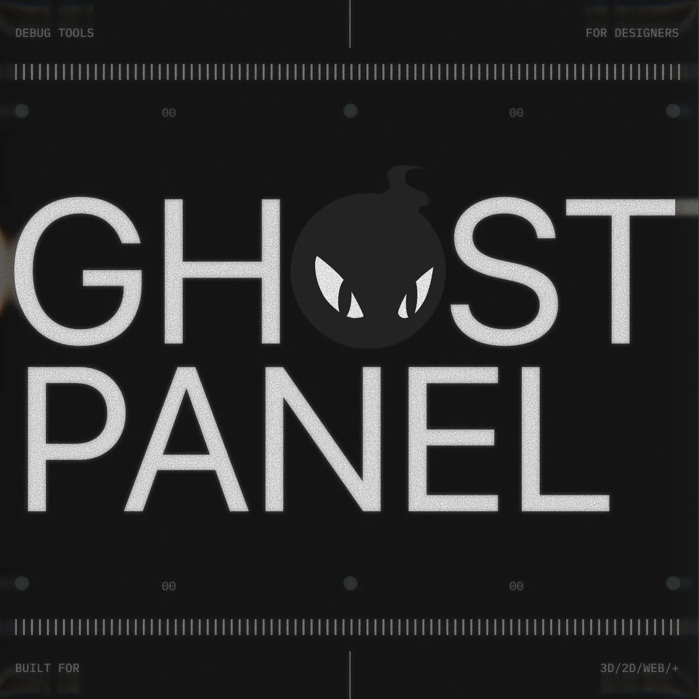

<p align="center">
  
</p>

# Ghost Panel

**A self-aware debug panel for the web.** Drop it into any Three.js scene, 2D canvas, or DOM page. It scans your project, mounts only the controls that fit, and stays out of the way. Press `Shift+D` to toggle the panel — `Shift+A` opens the add menu whenever you need more.

---

## Why Ghost Panel

Most debug UIs ask you to declare what controls should exist. Ghost Panel decides for you.

- **Scans your project on load.** Walks your Three.js scene, your DOM, your shape registry — whichever applies — and registers everything it finds. No `register()` boilerplate.
- **Mounts the right controls for the selection.** Click a mesh, the **Material** panel appears. Click a camera, **Camera Settings**. Click a light, intensity + color. Animation data in the scene? The **Graph Editor** appears on its own.
- **Ask for more, anytime.** `Shift+A` opens a workflow-aware add menu — every object, light, factory, and helper that's currently relevant. Type to filter. Add yours with one call.
- **Drop-in or progressive.** Three lines for the default. Deeper API when you want custom controls, custom workflows, or per-host extensions.

> Ghost Panel lives one layer above tweakpane / lil-gui — it builds the panel before you write the schema. It's a different philosophy from [dialkit](https://github.com/joshbriz/dialkit) too: dialkit is opinionated about the chrome around your dials, Ghost Panel is opinionated about *whether dials should exist at all* given what's on screen.

---

## Install

```bash
npm install ghost-panel
npm install three     # peer dep (only if you're using Three.js)
```

Or grab the source — Ghost Panel has no required runtime dependencies of its own:

```js
import { createGhostPanel } from './lib/ghost-panel/index.js';
```

---

## Use it in any project

The core API is one function — `createGhostPanel(options)` — and Ghost Panel ships first-party adapters for every popular front-end. Pick your stack:

<details open>
<summary><b>Vanilla JS / ES modules</b></summary>

```js
import { createGhostPanel } from 'ghost-panel';

const ui = createGhostPanel({ scene, camera, renderer });
```
</details>

<details>
<summary><b>HTML — drop-in &lt;script&gt; tag (no build step)</b></summary>

```html
<script src="https://unpkg.com/ghost-panel/dist/ghost-panel.umd.js"></script>
<script>
  const ui = GhostPanel.createGhostPanel({ /* options */ });
</script>
```
</details>

<details>
<summary><b>React</b></summary>

```jsx
import { GhostPanel } from 'ghost-panel/react';

function App() {
  return (
    <>
      <YourCanvas />
      <GhostPanel
        options={{ title: 'Inspector' }}
        onReady={(ui) => console.log('Ghost Panel ready', ui)}
      />
    </>
  );
}
```

Or as a hook:

```jsx
import { useGhostPanel } from 'ghost-panel/react';

function App() {
  useGhostPanel({ title: 'Inspector' });
  return <YourCanvas />;
}
```
</details>

<details>
<summary><b>Solid</b></summary>

```jsx
import { GhostPanel } from 'ghost-panel/solid';

function App() {
  let ui;
  return (
    <>
      <YourCanvas />
      <GhostPanel options={{ title: 'Inspector' }} onReady={(u) => (ui = u)} />
    </>
  );
}
```
</details>

<details>
<summary><b>Svelte</b></summary>

```svelte
<script>
  import { ghostPanel } from 'ghost-panel/svelte';
  let ui;
</script>

<YourCanvas />
<div use:ghostPanel={{
  options: { title: 'Inspector' },
  onReady: (u) => ui = u,
}} />
```
</details>

<details>
<summary><b>Vue 3</b></summary>

```vue
<script setup>
import { ref } from 'vue';
import { GhostPanel } from 'ghost-panel/vue';
const ui = ref(null);
</script>

<template>
  <YourCanvas />
  <GhostPanel :options="{ title: 'Inspector' }" @ready="ui = $event" />
</template>
```

Or as a global plugin:

```js
import { createApp } from 'vue';
import { GhostPanelPlugin } from 'ghost-panel/vue';
createApp(App).use(GhostPanelPlugin).mount('#app');
```
</details>

<details>
<summary><b>Claude Code / OpenAI Codex / Cursor (AI coding agents)</b></summary>

Ghost Panel is npm-installable, ships a JSDoc-annotated API, and includes a machine-readable surface at `AGENTS.md`. To wire it into any project an AI agent is editing:

```bash
npm install ghost-panel
```

```js
// One-liner that adapts to the host. The agent should pick the line
// matching the project's framework (React/Vue/Svelte/Solid) from above.
import { createGhostPanel } from 'ghost-panel';
const ui = createGhostPanel({ scene, camera, renderer });
```

The agent can then introspect available skills via `ui.skills.describe()` and add controls via `ui.addFolder(...).addSlider(...)` — see `AGENTS.md` for the schema and contract.
</details>

---

## Hello, world

```js
import { createGhostPanel } from 'ghost-panel';

createGhostPanel({ scene, camera, renderer });
```

That's it. Open localhost. Press `Shift+D`.

The panel walks your scene, finds every named mesh / light / camera, picks the right workflows, and surfaces them in the outliner. Select anything — the inspector switches its panel set automatically.

---

## What it figured out for you

When you call `createGhostPanel`, three passes run at init and re-run as your scene mutates:

| Pass | What happens |
|---|---|
| **1. Scene scan** | Walks the live scene tree, DOM, or 2D registry. Registers every named object. Catches async GLTF loads and dynamic spawns. |
| **2. Workflow detection** | Looks at materials, animations, shaders, DOM signals, and uniforms to pick which workflows are active — `3d`, `2d`, `web`, `animation`, `shader`, `audio`, `ascii`. Each one ships its own folder set. |
| **3. Selection-gating** | Mounts folders only when their selection target exists. Material doesn't appear until you click a mesh. Light controls don't appear until you click a light. The panel stays compact. |

You can always override by hand:

```js
createGhostPanel({
  scene, camera, renderer,
  workflow: ['3d', 'animation', 'shader'],   // explicit list
  autoRegister: false,                       // opt out of full-scene scan
});
```

---

## Ask for more — `Shift+A`

The thing that's not on screen is usually one keystroke away. `Shift+A` opens the add menu, scoped to the active workflows:

- **3D scene** → Cube · Sphere · Cylinder · Cone · Plane · Torus · Torus Knot · Icosphere · DirectionalLight · SpotLight · PointLight · RectAreaLight · PerspectiveCamera · OrthographicCamera · Image · GLTF · Video · Group · Empty · Sky / Hemisphere · TextureCheckerboard · GLSL Shader
- **2D canvas** → Circle · Rectangle · Triangle · Image
- **Web** → Card · Button · Pill · Icon · Tailwind Card · Tailwind Pill · Ghost Button · Heading · Divider

Type to filter, ↑↓ to navigate, ↩ to spawn. Each new object lands in the outliner pre-selected, ready to transform.

**Register your own factory** from host code:

```js
ui._addMenu.register({
  id:        'bloom-rig',
  label:     'Bloom rig',
  category:  'FX',
  workflows: ['3d'],
  icon:      icons.sparkle,
  build: () => {
    const group = new THREE.Group();
    /* … set up your effect, return the root … */
    return group;
  },
});
```

The factory shows up in `Shift+A` the next time the menu opens.

---

## What's in the box

| | |
|---|---|
| **Floating panels** | Inspector + Scene. Drag headers, collapse bodies, clamps to viewport, theme-aware. |
| **Outliner** | Click to select · eye to hide · trash to delete (with confirm modal) · double-click to rename · focus reticle to look through cameras. |
| **Contextual inspector** | Mini transform toolbar pinned to the panel edge. Live X/Y/Z + W/H + rotation. Drag-scrub or type to commit. |
| **Transform gizmos** | Real `THREE.TransformControls` in 3D · custom SVG handles in 2D · CSS-transform handles on DOM elements. `G`/`R`/`S` for modal transform with `X`/`Y`/`Z` axis constraints. |
| **Graph editor** | F-curves + dope sheet. Per-key easing. Scrubbable playhead. Bind tracks to any host property at runtime. |
| **Add menu** | `Shift+A`. Workflow-aware. Host-extensible. |
| **Export menu** | PNG · WebM · GLB · OBJ · SVG · CSS `@keyframes` · WAAPI script · GLSL source · JSON state · HTML snippet. Surfaces only the formats your active workflows can produce. |
| **Undo / redo** | `Cmd+Z` / `Cmd+Shift+Z`. Covers transforms, property edits, adds, deletes, paste, rename, visibility, mode swaps. |
| **Copy / paste** | `Cmd+C` / `Cmd+V`. Deep-clones Three.js objects or 2D plain-data bags. |
| **Save / restore** | JSON snapshot via header buttons, or `ui.toJSON()` / `ui.fromJSON()`. |
| **Themes** | shadcn/ui tokens. Built-in `zinc` / `slate` / `light`. Liquid Glass surface treatment. Any token overridable. |

---

## Recipes

### Three.js — auto-scan everything

```js
import { createGhostPanel } from 'ghost-panel';

const ui = createGhostPanel({
  scene, camera, renderer, controls,
  scenePanel: true,                 // adds the left Outliner panel
});

// Name your objects so the outliner labels them. That's enough.
heroMesh.name   = 'Hero';
lampGroup.name  = 'Lamp';
povCamera.name  = 'POV';

ui.bindToggleKey('D', { shift: true });

function frame() {
  requestAnimationFrame(frame);
  controls.update();
  ui.update();                      // keeps inspector live with the scene
  renderer.render(scene, camera);
}
frame();
```

### DOM elements — wrap, transform, tween

Add `data-ghost-panel` to anything you want to inspect:

```html
<div class="card" data-ghost-panel>Hero Card</div>
<button class="cta" data-ghost-panel>Get started</button>
```

```js
createGhostPanel({ scenePanel: true, visible: true });
// card + cta are now in the outliner with full transform, opacity,
// typography, and corner-radius controls. Drag the canvas gizmo to
// reposition; the live DOM updates in real time.
```

Or wire elements up explicitly when you want naming + initial state:

```js
import { createGhostPanel, createWebAdapter } from 'ghost-panel';

const ui = createGhostPanel({ scenePanel: true });
const card = createWebAdapter(document.getElementById('hero-card'), {
  name: 'Hero', x: 200, y: 150,
});
ui.objectManager.register('Hero', card);
```

### 2D canvas — register your shapes

```js
const circles = [
  { name: 'c.1', x: 100, y: 200, radius: 40, color: '#ff5577' },
  { name: 'c.2', x: 300, y: 200, radius: 60, color: '#5577ff' },
];

const ui = createGhostPanel({ scenePanel: true, workflow: '2d' });
circles.forEach(c => ui.objectManager.register(c.name, c));
```

The outliner gets each circle, the gizmo overlays on selection, properties (color, radius, etc.) appear in the inspector. Your render loop reads from `c.x` / `c.y` / `c.radius` directly.

### Custom controls anywhere

The folder API is fluent:

```js
ui.addFolder('Particles')
  .addSlider('Count',  { min: 100, max: 5000, step: 100, value: 1000, onChange: v => particles.setCount(v) })
  .addColor ('Tint',   { value: '#88ccff', onChange: c => particles.tint = c })
  .addCheckbox('Glow', { value: true,      onChange: v => particles.glow = v })
  .addButton('Reset',  () => particles.reset());
```

Add to either panel — `ui.addFolder(...)` writes to the right panel, `ui.scenePanel.addFolder(...)` writes to the left.

### Drive properties from the graph editor

```js
const ui = createGhostPanel({
  workflow: 'animation',
  workflowOpts: {
    duration: 4,
    tracks: [{
      name: 'hero → x',
      color: '#ff6b6b',
      binding: { object: heroAdapter, path: 'x' },
      keys: [
        { time: 0, value: 0,   easing: 'easeInOut' },
        { time: 2, value: 400, easing: 'easeInOut' },
        { time: 4, value: 0,   easing: 'easeInOut' },
      ],
    }],
  },
});

// Play in the panel with Spacebar, or programmatically:
import { playWithWAAPI } from 'ghost-panel';
const transport = playWithWAAPI(ui);
transport.play();
```

---

## Keyboard

| Key | Action |
|---|---|
| `Shift+D` | Toggle both panels |
| `Shift+A` | Add menu |
| `G` / `R` / `S` | Modal move / rotate / scale |
| `X` / `Y` / `Z` | Constrain modal transform to that axis |
| `Esc` | Cancel modal transform · close menus |
| `Cmd+Z` / `Cmd+Shift+Z` | Undo / redo |
| `Cmd+C` / `Cmd+V` | Copy / paste selection |
| `Delete` / `Backspace` | Remove the focused outliner row |
| `Space` | Play / pause the graph editor |

---

## Theming

```js
createGhostPanel({ theme: 'zinc' });    // default — neutral dark
createGhostPanel({ theme: 'slate' });   // cooler dark
createGhostPanel({ theme: 'light' });   // light mode
createGhostPanel({ liquidGlass: true }); // frosted iOS-26 surface
```

Custom palette via shadcn/ui design tokens (HSL components, no commas / percent signs):

```js
createGhostPanel({
  themeVars: {
    '--background':         '0 0% 100%',
    '--foreground':         '240 10% 4%',
    '--primary':            '142 76% 36%',
    '--primary-foreground': '0 0% 98%',
    '--border':             '240 6% 90%',
    '--radius':             '0.75rem',
  },
});
```

Or override directly in CSS:

```css
.ghost-panel {
  --primary: 217 91% 60%;
  --radius:  0.75rem;
}
```

---

## API

### `createGhostPanel(opts) → ui`

| Option | Default | Description |
|---|---|---|
| `title` | `'Debug'` | Inspector header text |
| `side` | `'right'` | `'left'` or `'right'` |
| `width` | auto | Inspector px width override |
| `visible` | `false` | Start visible |
| `theme` | `'zinc'` | `'zinc'` · `'slate'` · `'light'` |
| `themeVars` | — | CSS custom-property overrides |
| `liquidGlass` | `false` | `true` · `'light'` |
| `liquidGlassScenePanel` | `false` | Same for the scene panel |
| `scenePanel` | `false` | Add the left Outliner panel |
| `scene` · `camera` · `renderer` · `controls` | — | Three.js handles. Trigger the 3D workflow automatically. |
| `autoRegister` | `true` | Auto-scan and register scene objects |
| `workflow` | `'auto'` | `'3d'` · `'animation'` · `'web'` · `'2d'` · `'audio'` · `'shader'` · `'ascii'` · `'auto'` · array |
| `workflowOpts` | `{}` | Per-workflow opts forwarded to that workflow's setup |

### `ui`

| Member | What it does |
|---|---|
| `ui.panel` · `ui.scenePanel` | Underlying `Panel` instances. `addFolder`, `getFolder`, `setLiquidGlass`, `setTheme`, etc. |
| `ui.addFolder(name, opts?)` | Shortcut for `ui.panel.addFolder(...)` |
| `ui.show()` · `ui.hide()` · `ui.toggle()` · `ui.isVisible()` | Visibility control |
| `ui.bindToggleKey(key, mods?)` | Global toggle shortcut |
| `ui.objectManager` | `SceneObjectManager` (Three.js) or generic `ObjectManager`. Has `register`, `select`, `remove`, `on('change' \| 'select' \| 'register' \| 'remove')`, etc. |
| `ui.activeWorkflows` | Array of active workflow ids |
| `ui.enableWorkflow(name, opts)` · `ui.disableWorkflow(name)` | Manual workflow control |
| `ui.rescan()` | Force a re-scan of the scene + workflow detection (also runs automatically on register/remove) |
| `ui.update()` | Call inside your render loop to keep live values synced |
| `ui.toJSON()` · `ui.fromJSON(data)` · `ui.downloadJSON()` · `ui.loadJSONFile()` | State serialization |
| `ui.dispose()` | Tear down panels, gizmos, listeners |

### Folder API

```js
const f = ui.addFolder('Lighting');

f.addSlider   (label, { min, max, step, value, suffix, onChange, id })
f.addColor    (label, { value, onChange, id })
f.addCheckbox (label, { value, onChange, id })
f.addNumber   (label, { min, max, step, value, suffix, onChange, id })
f.addSelect   (label, { options, value, onChange, id })
f.addText     (label, { value, placeholder, multiline, onChange, id })
f.addButton   (label, onClick)        // or (label, { onClick, tooltip })
f.addButtonRow([{ label, onClick }, ...])
f.addFile     (label, { accept, onChange })
f.addVec3     (label, { value, min, max, step, onChange })
f.addInfo     (text, id)              // read-only display
f.addRaw      (htmlElement)           // bring your own widget

f.get('id').setValue(x)               // programmatic update
f.collapse() · f.expand() · f.toggleCollapsed()
```

---

## Production builds

`ghost-panel/dev-mode` keeps the whole library out of your production bundle:

```js
import { initIfDev } from 'ghost-panel/dev-mode';

initIfDev(async () => {
  const { createGhostPanel } = await import('ghost-panel');
  createGhostPanel({ scene, camera, renderer });
});
```

`initIfDev` reads `import.meta.env.PROD`, `process.env.NODE_ENV`, and `window.__DEBUG_UI_PRODUCTION__`. The dynamic import becomes a no-op chunk in your production bundle.

---

## Cleanup

```js
ui.dispose();   // removes panels, gizmos, listeners, injected styles
```

---

## License

MIT — drop it into anything.
